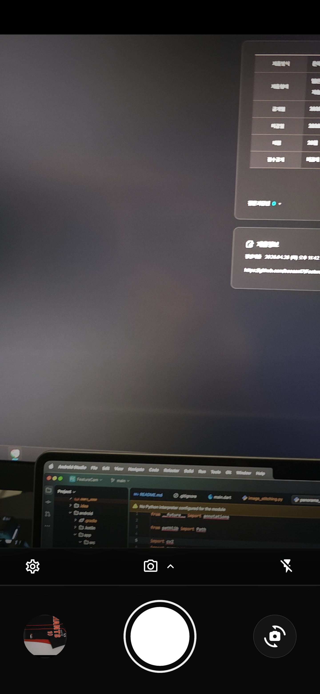
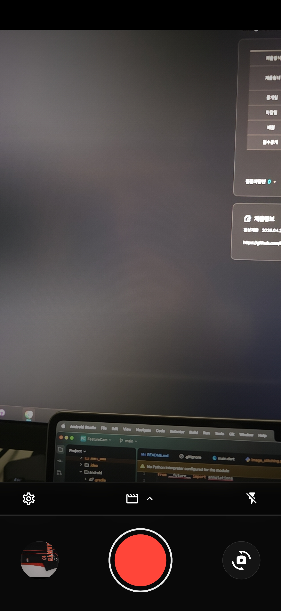
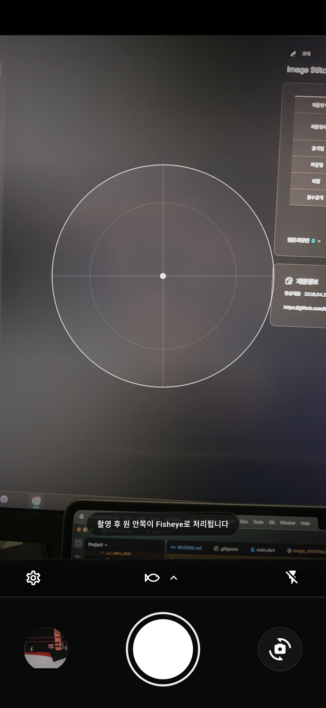
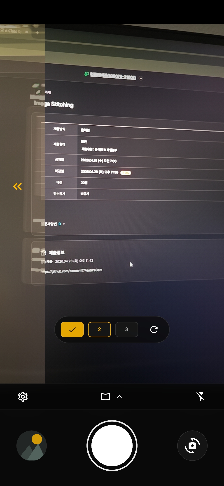
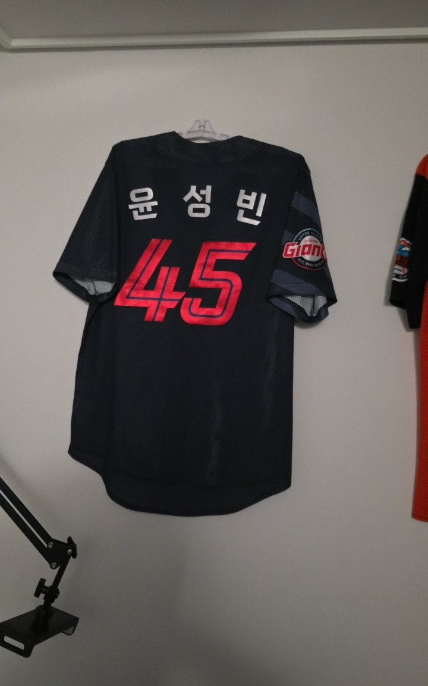
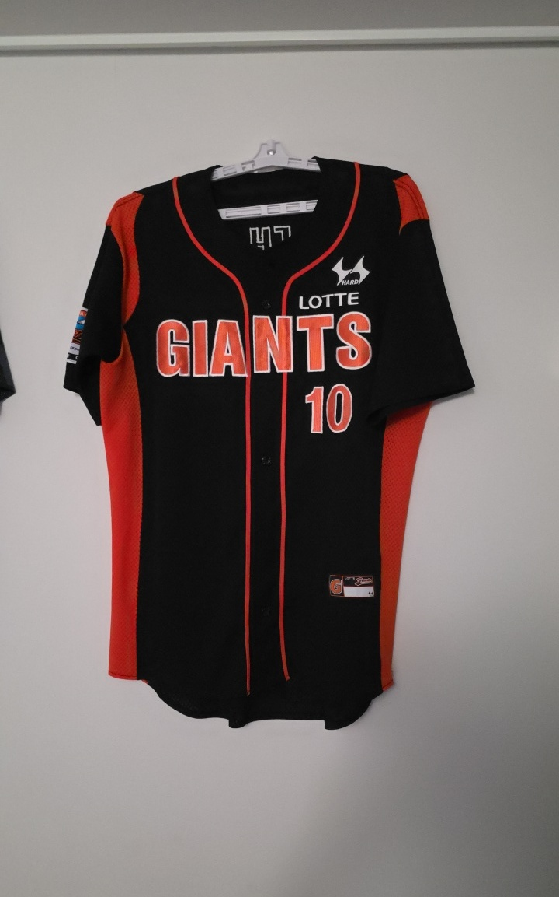
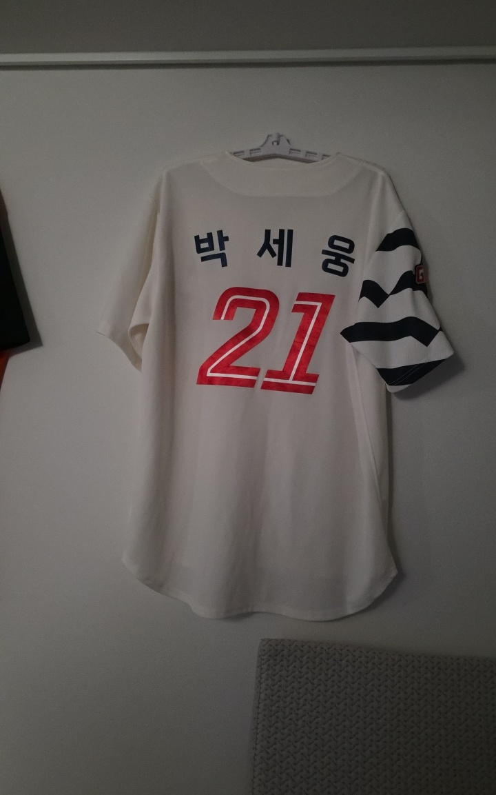
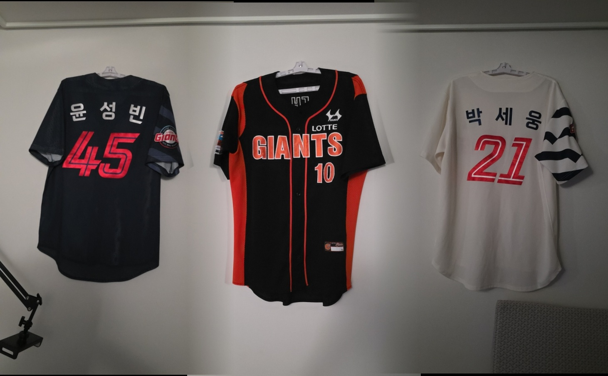

# FeatureCam

Android 전용 Flutter 카메라 앱입니다. Flutter는 UI와 촬영 흐름을 담당하고, 이미지 처리는 APK 안에 포함된 Python 코드가 Chaquopy를 통해 스마트폰 로컬에서 실행합니다.

## 주요 기능

- 일반 사진 촬영
- Fisheye 사진/영상 처리
- Panorama 3장 촬영 및 합성
- `DCIM/FeatureCam/` 저장
- 앱 내부 갤러리 및 이미지 뷰어
- 세로/가로 기기 방향에 맞춘 아이콘/가이드 UI

## 화면 예시

| Original Camera | Video |
| --- | --- |
|  |  |

| Fisheye | Panorama |
| --- | --- |
|  |  |

Panorama는 왼쪽에서 오른쪽으로 촬영한 3장의 사진이 하나로 합쳐지는 기능입니다.

```text
[사진 1] + [사진 2] + [사진 3] -> [Panorama 합성 결과]
```

| Panorama 원본 1 | Panorama 원본 2 | Panorama 원본 3 | 합성 결과 |
| --- | --- | --- | --- |
|  |  |  |  |

## 코드 구조

```text
FeatureCam/
  app/
    lib/
      main.dart
      app/feature_cam_app.dart
      camera/
        camera_controller_service.dart   # camera plugin 제어
        capture_store.dart               # 임시 파일, 파일명, DCIM 저장
        camera_modes.dart                # photo/video/fisheye/panorama 상태 모델
      gallery/
        feature_cam_gallery_store.dart   # DCIM/FeatureCam MediaStore 조회
      processing/
        processing_client.dart           # Flutter -> Kotlin processing channel
      ui/
        camera_screen.dart               # 메인 카메라 화면/모드/촬영 흐름
        camera_preview_view.dart         # CameraPreview 표시
        panorama_guide_overlay.dart      # panorama 20% overlap 가이드
        fisheye_lens_overlay.dart        # fisheye 원형 overlay
        feature_cam_gallery_screen.dart  # 앱 내부 갤러리

    android/app/src/main/kotlin/com/example/feature_cam/
      MainActivity.kt                    # MethodChannel, MediaStore, Chaquopy bridge

    android/app/src/main/python/
      feature_processor.py               # Kotlin에서 호출하는 Python entrypoint
      processors/
        fisheye.py                       # fisheye remap 알고리즘
        image_processor.py               # fisheye image 파일 처리
        video_processor.py               # fisheye video 파일 처리
        panorama_stitcher.py             # 3장 panorama 합성

  Legacy/
    image_stitching.py                   # 참고용 레퍼런스 Python 코드

  documents/
    architecture.md
    ui.md
```

## 실제 앱에서 쓰는 Python 코드

현재 앱 기능에 영향을 주는 Python 코드는 아래 폴더 하나입니다.

```text
app/android/app/src/main/python/
```

`python_backend/` 방식은 예전 HTTP 서버 구조에서 쓰던 방향이었고, 현재 구조에서는 앱 기능에 필요하지 않습니다. 앱은 외부 Python 서버 없이 APK에 포함된 Python 코드를 Chaquopy로 실행합니다.

## Kotlin / Python 연결

Flutter는 `MethodChannel`로 Kotlin에 요청합니다.

- `feature_cam/processing`
  - `processPhoto`
  - `processVideo`
  - `processPanorama`
- `feature_cam/media_store`
  - `saveToDcim`
  - `cropImageToAspect`
  - `listFeatureCamMedia`
  - `loadMediaBytes`
  - `openMedia`
- `feature_cam/orientation`
  - Android sensor 방향을 Flutter UI에 전달

Kotlin의 [MainActivity.kt](app/android/app/src/main/kotlin/com/example/feature_cam/MainActivity.kt)가 Chaquopy로 [feature_processor.py](app/android/app/src/main/python/feature_processor.py)를 호출합니다.

## 사용한 주요 라이브러리

Flutter:
- `camera`: Android 카메라 preview/photo/video
- `path_provider`: 앱 내부 임시 저장 경로

Android/Kotlin:
- `MediaStore`: `DCIM/FeatureCam/` 저장 및 갤러리 조회
- `ExifInterface`: 저장 이미지 방향 보정
- `MethodChannel`, `EventChannel`: Flutter와 native 통신

Python:
- `numpy`
- `opencv-python`
- Chaquopy로 APK에 패키징

Chaquopy 설정은 [app/android/app/build.gradle.kts](app/android/app/build.gradle.kts)에 있습니다.

## Fisheye 처리

Fisheye는 실시간 preview가 아니라 촬영 후 처리 방식입니다.

흐름:

```text
Flutter overlay circle
  -> capture original image/video
  -> Kotlin MethodChannel
  -> Python feature_processor.py
  -> processors/fisheye.py remap
  -> DCIM/FeatureCam 저장
```

핵심 파일:

- [fisheye.py](app/android/app/src/main/python/processors/fisheye.py)
- [image_processor.py](app/android/app/src/main/python/processors/image_processor.py)
- [video_processor.py](app/android/app/src/main/python/processors/video_processor.py)

## Panorama 처리

Panorama는 왼쪽에서 오른쪽으로 3장을 촬영합니다.

촬영 규칙:

```text
1번 이미지 오른쪽 20% == 2번 이미지 왼쪽 20%
2번 이미지 오른쪽 20% == 3번 이미지 왼쪽 20%
```

UI:
- 1장 촬영 후 이전 이미지의 오른쪽 20%를 반투명 guide로 표시
- 사용자는 guide에 맞춰 다음 이미지를 겹쳐 촬영
- 세로/가로 촬영 모두 같은 20% overlap 규칙 사용

합성:
- [panorama_stitcher.py](app/android/app/src/main/python/processors/panorama_stitcher.py)
- 세 이미지를 같은 높이로 맞춤
- 각 이미지 폭의 20%를 overlap으로 계산
- overlap 구간은 horizontal alpha blend
- 작은 상하 흔들림은 overlap strip 비교로 보정
- `cv2.Stitcher` 같은 high-level panorama API는 사용하지 않음

## 레퍼런스 Python 파일과 반영 위치

참고한 레퍼런스는 image_stitching.py 입니다.

이 레퍼런스는 다음 아이디어를 보여줍니다.

- feature detector 사용
- Hamming 기반 descriptor matching
- planar stitching 흐름


## 저장 위치와 파일명

촬영 결과는 Android 갤러리의 아래 위치에 저장됩니다.

```text
DCIM/FeatureCam/
```

파일명 규칙:

```text
yymmdd_hhmmss_code.ext
```

코드:

- `or`: original photo
- `fs`: fisheye
- `pn`: panorama
- `vd`: video

예:

```text
260428_154422_or.jpg
260428_154510_fs.jpg
260428_154610_pn.jpg
260428_154800_vd.mp4
```


## 주의

- Android 전용 프로젝트입니다.
- Python 처리는 스마트폰 로컬에서 실행됩니다.
- `Legacy/`는 참고 코드이며 실제 앱 런타임에 포함되지 않습니다.
- 실제 앱 런타임 Python 코드는 `app/android/app/src/main/python/`만 보면 됩니다.
